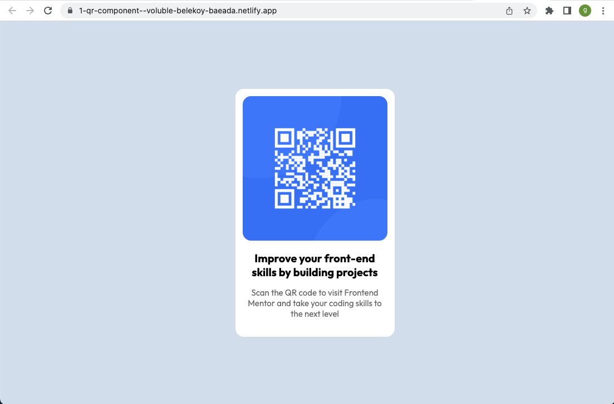

# Frontend Mentor - QR code component solution

This is a solution to the [QR code component challenge on Frontend Mentor](https://www.frontendmentor.io/challenges/qr-code-component-iux_sIO_H). Frontend Mentor challenges help you improve your coding skills by building realistic projects.

## Table of contents

- [Overview](#overview)
  - [Screenshot](#screenshot)
  - [Links](#links)
  - [Built with](#built-with)

## Overview

### Screenshot

### Links

- Solution URL: [FrontendMentor Repo](https://github.com/gracepal/FrontentMentor)
- Live Site URL: [Live on Netlify](https://main--unrivaled-brigadeiros-cd2dae.netlify.app/)

### Built with

- Semantic HTML5 markup
- Google font
- Flexbox
